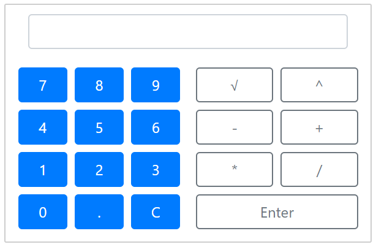
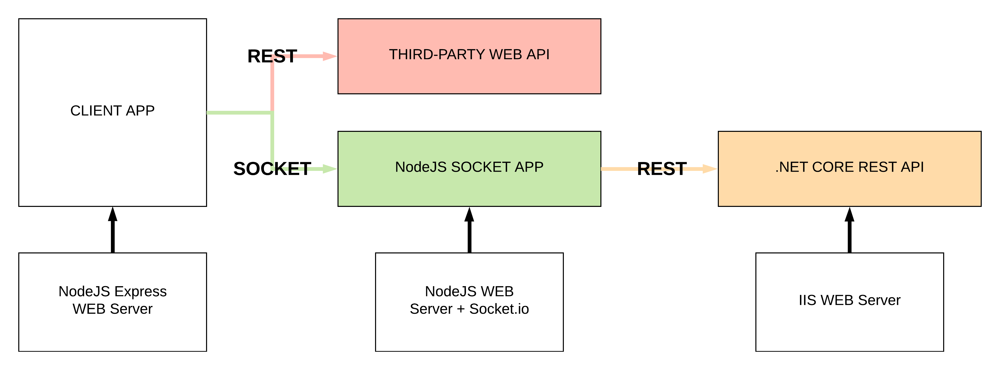
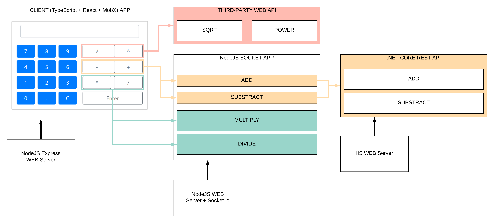

# Calculator

## Author

Martin Chaov #25833

## Overview

This project defines software solution for distributed calculator.

The solution comprises of 3 applications + third-party service implementation.

User consumed application is called "client" for short.

### Requirements

Create a distributed calculator application. Application must be able to scale both horizontally and vertically. Implement the basic mathematical operations: addition, substraction, multiplication, division, square root, and ``x`` to the power of ``y``.

### NFRs

Based on the application requirements the best approach is going to be to couple the similar mathematical operations based on the DDD approach.

We are aiming for high cohesion and low coupling. Addition and substraction are going to be implemented in the same application. Division and multiplications are going to be united in one application too.

For ease of consumption all the in-house developed services are going to be accessed via the same application. To enable faster responses we are going to use web socket application for this purpose.

Taking into consideration the need for automatic horizontall scale all services must be stateless.

To enable easier unit testing all the implemented services must be referentially transparent.

Based on the time frames we are going to consume two of the mathematical operations via third-party services.

## Client application



Client application is a web based interface which consumes different math services. It implements its own web server that serves its content. This application is end-user focused.

It has internal state which represents what data is shown in the UI. To enable fast and reliable development the application development cycle involves unit and code coverage tests.

### Implemented features

- WEB server
- [SOCKET] Addition
- [SOCKET] Substraction
- [SOCKET] Division
- [SOCKET] Multiplication
- [REST] Power
- [REST] Square root
- Internal state
- Routing

### Tech stack

- TypeScript
- MobX
- React
- ExpressJS
- Jest
- Enzyme
- Webpack
- Socket.io client

Technology stack is comprised of popular and reliable tools for client side development. All of the frameworks and libraries are production tested. They provide reliable performance and ease of development.

TypeScript was chosen because it provides easy way to build our application with different compatibility options. This offloads the worries for browser compatibility to a compiler where it belongs, and away from the developers who should focus on business logic.

React is a very small and fast library that implements declarative approach to defining a user interface. It enables code reuse.

MobX is providing observable pattern for our React application. Easier to use and integrate than libraries such as RxJS. Provides tools to define mutable state with is more performant than the Redux/Flux approach.

Jest and Emzyme enable us to programatically test our application without the need for a web browser. This makes work with unit test a breeze.

Webpack is one of the best all around build tools on the market. It outperforms it competitors by performance, features and extensibility.

Socket.io client to connect to our server socket implementation.

## Socket Application

NodeJS based socket application. This application implements multiplication and division operations. It also integrades with the .NET Core application to consume the addition and substraction operations via REST.

Socket application is served via its own web server.

### Implemented features

- Division
- Multiplication
- [REST] Addition
- [REST] Substraction

### Tech stack

- NodeJS
- Socket.io server

This tech stack was chosed mainly because of the implementation simplicity. The entire web server is implemnted/configured in few lines of code:

```javascript
const server = require('http').createServer();
const io = require('socket.io')(server);

io.on('connection', client => {
    // socket events implementation
});

server.listen(4001);
```

JavaScript was chosed because it is a simple yet reliable language that most of the developers can use. The entire application under 100 lines of code and contained within one file. Something almost impossible to do with .NET/Java.

Because of the tech stack and its small size, this application can be scaled very easily.

## .NET Core Web API

ASP.NET Core Web Application using the .NET Core framework 2.xx. Implements addition and substraction in .NET MVC. Request/Responce over HTTP GET with input via query parameters. Operations are consumed in a RESTfull way.

This application implements its own web server and is not affiliated with the rest of the applications with regards to hosting.

### Implemented features

- Addition
- Substraction

### Tech stack

- .NET Core 2.1
- .NET MVC

Tech stack is entirely Microsoft based. We are using the open source .NET Core because of it's much lighter runtime. ASP.NET Core provides multiple tools to enable rapid development of WEB APIs.

## Third-party service

Using the third-party [http://api.mathjs.org](http://api.mathjs.org). This service is consumed in a RESTfull way and provides multiple mathematical operations.

Consumed features from the service:

- Square root
- Power x^y

The market doesn't provide much diversity in this case. The main plan is to use this service until we gather resources to develop the rest of the functionality ourselves.

## Solution architecture



Client application communicates with the socket application to consume the in-house implemented features. It also implements the communication with the third-party service. 

Third-paty service is treated like a black box. It is queried via HTTP GET. We do not know if the service is RESTfull or something else.

Connection between client and socket application is established by using HTTP upgrade header which moves the connection from the application layer to the TCP layer where sockets are working.

Socket application queries the .NET Core application in a standart REST request/response.

For a more detailed architecture check the following figure:


